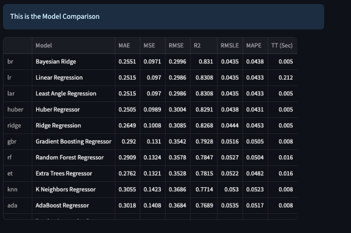
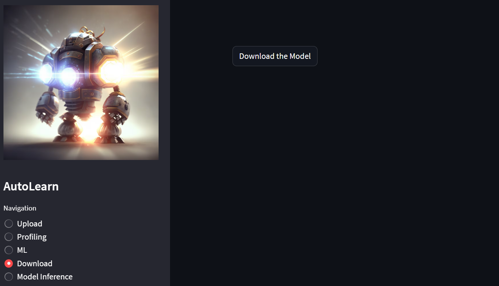

# AutoLearn

## Starting Software and Loading Data

1. Install software using [INSTALLATION](INSTALLATION.md)

2. Get some data, here is the Iris dataset I'll be using [iris dataset.](https://archive.ics.uci.edu/dataset/53/iris)

3. Load data into AutoLearn

## Data Profiling Features

### Data Overview

### Data Alerts

### Rich Column Level Statistics & Visuals

### Identify Correlations Between Variables

### Visualize Missing Values

### View Data Samples

### Find Duplicate Rows

## Automated Machine Learning

### Automated ML Experiment Settings

### Model Leaderboard

### Download Best Model

