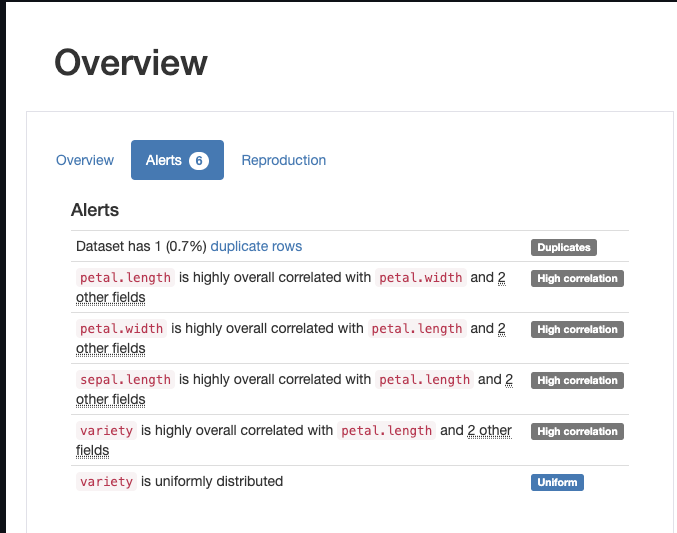

# 🤖 AutoLearn

AutoLearn is a powerful tool for data scientists that automates the process of exploratory data analysis (EDA) and machine learning model training. By utilizing PyCaret and Pandas Data Profiler, AutoLearn streamlines the data analysis and model building process, providing several benefits for data scientists:

1. ⏰ **Time-saving**: AutoLearn automates the time-consuming tasks of data profiling, data visualization, and model training. This allows data scientists to focus on higher-level tasks, such as feature engineering and model interpretation.

2. 🚀 **Efficiency**: With AutoLearn, data scientists can quickly gain insights into the dataset by utilizing the data profiling features. The app identifies potential issues in the data, such as missing values and data type inconsistencies, saving time and effort in manual data cleaning.

3. 🤔 **Improved decision-making**: AutoLearn provides rich column-level statistics and visuals, allowing data scientists to understand the distribution and characteristics of each variable. This helps in making informed decisions during feature selection and model building.

4. 🚀 **Enhanced model performance**: By running an automated machine learning experiment, data scientists can explore different feature engineering techniques and model algorithms. The app generates a leaderboard of trained models, ranked by their performance metrics, enabling data scientists to select the best-performing model for their task.

5. 🔁 **Reproducibility**: AutoLearn allows data scientists to save and download the best-performing machine learning model for further use. This ensures reproducibility and enables easy deployment of the trained model in production environments.

## 🔌 Installation

To run this app, please follow the installation instructions provided in the [INSTALLATION](INSTALLATION.md) file.

## 🛣 Getting Started

1. Download the Iris dataset from the following link: [Iris Dataset](https://archive.ics.uci.edu/dataset/53/iris)

2. Load the dataset into the app by clicking on the "Upload Data" button.

## 🔍 Data Profiling Features

### Data Overview

The app provides an overview of the loaded dataset, including the number of rows, columns, and data types.

### Data Alerts

The app identifies potential issues in the dataset, such as missing values, high cardinality, and data type inconsistencies.

### Rich Column Level Statistics & Visuals

The app generates various statistics and visualizations for each column in the dataset, including histograms, tables, and descriptive statistics.

### Identify Correlations Between Variables

The app identifies correlations between variables and visualizes them using interaction plots and heatmaps.

### Visualize Missing Values

The app provides a visualization of missing values in the dataset.

### View Data Samples

The app allows you to view a sample of the loaded dataset.

### Find Duplicate Rows

The app identifies and displays duplicate rows in the dataset.

## 🤖 Automated Machine Learning

### Automated ML Experiment Settings

The app provides settings for running an automated machine learning experiment, including target variable selection, feature engineering, and model selection.

* **Regression**

* **Classification**

* **Clustering**

### Model Leaderboard

The app displays a leaderboard of trained machine learning models, ranked by their performance metrics.

* **Regression**

* **Classification**

* **Clustering**

### Download Best Model

The app allows you to download the best-performing machine learning model for further use.

## Conclusion

This Streamlit app provides a user-friendly interface for performing automated exploratory data analysis and machine learning model training. It leverages the power of PyCaret and Pandas Data Profiler to simplify the data analysis and model building process.